<!-- Generated by GitHub Profile Agent Console. Edit profile.config.json, then run npm run generate. -->

  <picture>
    <source media="(max-width: 760px) and (prefers-color-scheme: dark)" srcset="./assets/hero/agent-console-d538611d-mobile-dark.svg">
    <source media="(max-width: 760px)" srcset="./assets/hero/agent-console-d538611d-mobile-light.svg">
    <source media="(prefers-color-scheme: dark)" srcset="./assets/hero/agent-console-d538611d-dark.svg">
    <source media="(prefers-color-scheme: light)" srcset="./assets/hero/agent-console-d538611d-light.svg">
    
  </picture>

  
  

## About Me

I'm a student passionate about learning software development and building useful projects.

My work combines technical exploration with a builder mindset: understand the problem, test the system, and share what actually works.

## Current Focus

| Area | What I am exploring |
| --- | --- |
| **Frontend Development** | Building responsive and interactive user interfaces using HTML, CSS, and JavaScript |
| **Backend Development** | Building server-side logic, APIs, and managing databases to support web applications |
| **UI/UX** | Designing clean and intuitive user interfaces that are easy and enjoyable to use |

## Featured Work

| Project | Focus | Why it matters |
| --- | --- | --- |
| [**Sistem Pegawai**](https://github.com/Kuhiko01/website_sisitem_pegawai_ujikom) | Employee Data Management System | A web application for managing employee data digitally, including attendance, work schedules, and staff information, to make administrative processes more organized and efficient. |
| [**Website CAH ANGON**](https://github.com/Kuhiko01/Website_CAH-ANGON) | Landing Page | A landing page introducing the CAH ANGON community, featuring information about its activities and members. |

## Research Direction

I enjoy building complete web solutions, from frontend design to backend logic and data management.

## Tech Stack

`HTML` · `CSS` · `JavaScript` · `PHP` · `MySQL`

## Recent Activity

<!-- AUTO:ACTIVITY:START -->
- Aug 15, 2026: pushed 1 commit to [Kuhiko01/Kuhiko01](https://github.com/Kuhiko01/Kuhiko01).
- Jul 31, 2026: pushed 1 commit to [Kuhiko01/Kuhiko01](https://github.com/Kuhiko01/Kuhiko01).
- Jul 31, 2026: pushed 1 commit to [Kuhiko01/website_sisitem_pegawai_ujikom](https://github.com/Kuhiko01/website_sisitem_pegawai_ujikom).
- Jul 31, 2026: created a branch in [Kuhiko01/website_sisitem_pegawai_ujikom](https://github.com/Kuhiko01/website_sisitem_pegawai_ujikom).
<!-- AUTO:ACTIVITY:END -->

---

  Always learning and building something new.

